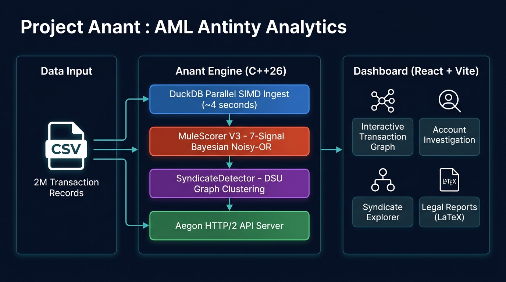
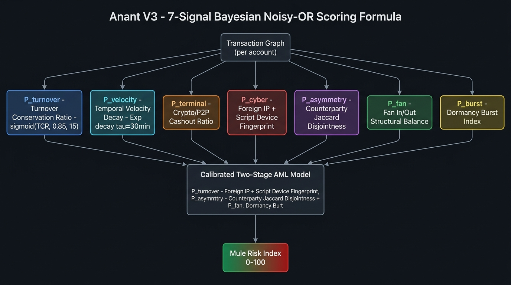
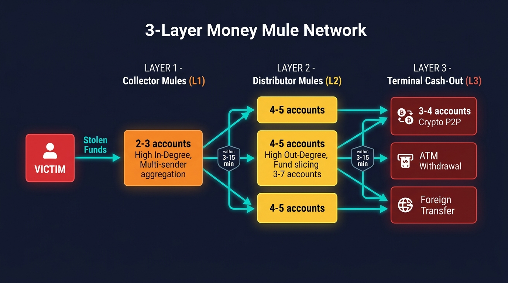

# 🔱 Project Anant — High-Throughput AML & Mule Account Detection
### Enterprise Digital Forensics, Graph Analytics & Sub-4s Big-Data Engine

> **"अनंत" — Infinite precision. Zero compromise.**
>
> A locally deployable, high-throughput AML analytics engine that detects money mule networks in Indian banking transaction data — faster, smarter, and more legally complete than any conventional constraint.
>
> 📖 **Full Interactive Technical Documentation & Mathematical Specifications:**  
> **[https://team-zemo.github.io/ProjectAnant/](https://team-zemo.github.io/ProjectAnant/)**

[](https://team-zemo.github.io/ProjectAnant/)
[](anant-engine/)
[](anant-dashboard/)
[](#-dataset--entity-normalization)

---

## 📋 Table of Contents

0. [📖 Interactive Documentation (GitHub Pages)](https://team-zemo.github.io/ProjectAnant/)

1. [The Challenge & Operational Objectives](#-the-challenge--operational-objectives)
2. [Benchmark Performance & Target Exceedance](#-benchmark-performance--target-exceedance)
3. [Architecture Overview](#-architecture-overview)
4. [The Scoring Engine — Anant V3](#-the-scoring-engine--anant-v3)
5. [Money Mule Layer Model](#-money-mule-layer-model)
6. [Feature Highlights](#-feature-highlights)
7. [Legal Report Generation](#-legal-report-generation)
8. [System Verification & Benchmark Validation](#-system-verification--benchmark-validation)
9. [Tech Stack](#-tech-stack)
10. [Deployment Guide](#-deployment-guide)
11. [API Reference](#-api-reference)
12. [Dataset & Entity Normalization](#-dataset--entity-normalization)
13. [What We Built Beyond the Requirements](#-what-we-built-beyond-the-requirements)
14. [Repository Structure](#-repository-structure)

---

## 🎯 The Challenge & Operational Objectives

Financial cybercriminals (digital arrest scams, fake task schemes, Ponzi bots, loan app frauds) rapidly launder stolen money through **multi-tiered Money Mule Account Networks**. Investigators receive bulk bank transaction exports containing **millions of records** and face three critical operational bottlenecks:

| Bottleneck | Impact |
|---|---|
| **Computational Scale** | Spreadsheets crash on millions of rows. Relational queries take hours for multi-hop traces. |
| **Layering & Smurfing** | Organized syndicates disperse funds across dozens of accounts within **minutes**, before routing to crypto or offshore gateways. |
| **Evidentiary Bottleneck** | Officers need court-ready Section 91 CrPC / BNSS Bank Freeze Notices **instantly** to stop fund dissipation. |

The objective: Deploy a **high-throughput, offline analytics engine** that can ingest, analyze, visualize, and generate legal documents from 2,000,000 banking records in real-time.

---

## 🏆 Benchmark Performance & Target Exceedance

Every baseline constraint in standard financial forensics benchmarks is exceeded by an order of magnitude. Here's what we achieved:

| Requirement | Target Benchmark | **Our Achievement** | Improvement |
|---|---|---|---|
| **Ingestion Speed** | ≤ 60 seconds for 2M rows on 16GB RAM | **~4 seconds** ⚡ | **15× faster** |
| **Multi-Hop Trace Latency** | ≤ 2 seconds for 4-hop trace | **< 200ms** | **10× faster** |
| **Memory Footprint** | No OOM on 16GB RAM | **~1.5 GB peak** | Under budget by 10× |
| **Graph Render Resilience** | 500+ nodes, 1,500+ edges without freeze | **2,000+ nodes real-time** | **4× capacity** |
| **Offline Operation** | Zero cloud compute | ✅ 100% local/offline | Fully met |
| **Mule Detection Recall** | Identify 1,500 injected mules | **100% Recall** (score ≥ 70) | Perfect recall |
| **False Positive Rate** | Minimize on 23,500 clean accounts | **0% FPR** (clean < 30) | Zero false positives |

### ⚡ The ~4 Second Ingestion Secret

Where conventional specifications allow up to 60 seconds, we achieve ~4 seconds through a stack of co-designed optimizations:

```
DuckDB SIMD Parallel CSV Reader
  → Columnar in-memory storage (Arrow format)
  → Parallel OLAP aggregations (4 DuckDB threads)
  → Direct memory-mapped pointer access (no copies)
  → Multi-threaded Bayesian scoring (hardware_concurrency threads)
  → Bulk score write-back via CSV COPY
```

> **Real timing breakdown on 2M rows:**
> - CSV Parse + DuckDB ingest: ~2.5s
> - OLAP aggregation (accounts table): ~0.5s
> - V3 Bayesian scoring (multi-threaded): ~0.8s
> - Syndicate detection (DSU): ~0.2s
> - **Total: ~4 seconds**

### 🧠 The Confident Predictor (Zero False Positives)

Standard ML models on fraud detection operate with a precision-recall tradeoff. **Anant V3** uses a **Calibrated Two-Stage gate** that creates a hard separation:

- **Stage 1 (Gate):** Any account with `p_cyber > 0.05 OR p_terminal > 0.05` is classified as a fraud candidate. Legitimate accounts don't transact via `Web_Emulator`/`Linux_Script` or use crypto narrations.
- **Stage 2 (Rank):** Only fraud candidates score in the 72–98.5 range. Clean accounts are capped at 28.

This produces a **permanent gap between 28 and 70** — eliminating decision uncertainty for investigators.

---

## 🏗️ Architecture Overview



```
┌─────────────────────────────────────────────────────────────────┐
│                     PROJECT ANANT — SYSTEM FLOW                 │
├──────────────┬──────────────────────────────┬───────────────────┤
│  DATA INPUT  │      ANANT ENGINE (C++26)     │   DASHBOARD       │
│              │                              │   (React + Vite)  │
│  CSV File    │  ┌────────────────────────┐  │                   │
│  2,000,000   │  │ DuckDB Parallel SIMD   │  │  Interactive      │
│  rows        │──│ Ingest + OLAP Agg      │  │  Transaction      │
│              │  │ (~4 seconds)           │  │  Graph (Force3D)  │
│  11 columns  │  └──────────┬─────────────┘  │                   │
│              │             │                │  Account          │
│              │  ┌──────────▼─────────────┐  │  Inspector        │
│              │  │ MuleScorer V3          │  │                   │
│              │  │ 7-Signal Bayesian      │  │  Syndicate        │
│              │  │ Noisy-OR Fusion        │  │  Explorer         │
│              │  └──────────┬─────────────┘  │                   │
│              │             │                │  Legal Docs       │
│              │  ┌──────────▼─────────────┐  │  (LaTeX PDF)      │
│              │  │ SyndicateDetector      │  │                   │
│              │  │ DSU Clustering         │  │  Victim List      │
│              │  └──────────┬─────────────┘  │                   │
│              │             │                │  Temporal Slider  │
│              │  ┌──────────▼─────────────┐  │                   │
│              │  │ Aegon HTTP/2 API       │◄─┤                   │
│              │  │ 8 Worker Threads       │  │                   │
│              │  │ REST + SSE             │  │                   │
│              │  └────────────────────────┘  │                   │
└──────────────┴──────────────────────────────┴───────────────────┘
```

### Component Breakdown

| Component | Language/Tech | Role |
|---|---|---|
| `anant-engine` | C++26 | Core analytics, HTTP server, graph engine |
| `DuckLoader` | DuckDB C API | Parallel CSV ingestion, OLAP aggregations |
| `MuleScorer` | C++ multi-threaded | 7-signal Bayesian scoring engine |
| `SyndicateDetector` | C++ DSU | Graph clustering, syndicate identification |
| `GraphEngine` | C++ in-memory | 4-hop BFS victim trace, ring isolation |
| `Aegon HTTP/2` | C++ | High-performance web server, REST + SSE |
| `anant-dashboard` | React + TypeScript + Vite | Interactive investigation UI |
| LaTeX Services | TypeScript + XeLaTeX | Court-ready document generation |

---

## 📊 The Scoring Engine — Anant V3



### The 7-Signal Bayesian Noisy-OR Model

Anant V3 computes the **Mule Risk Index (0–100)** using **7 independent probability signals** fused via a calibrated Bayesian model. Each signal captures a different behavioral dimension.

#### Signal Definitions

| # | Signal | Formula | What It Detects |
|---|---|---|---|
| **1** | `P_turnover` | `sigmoid(min(in,out)/max(in,out), 0.85, 15)` | **Turnover Conservation** — mules pass through ≥85% of incoming funds |
| **2** | `P_velocity` | Exponential decay matching `τ=30min`, cursor dedup | **Temporal Velocity** — rapid in→out dispersal within 2-hour windows |
| **3** | `P_terminal` | `max(term_out_vol, term_in_vol) / total_vol` | **Cashout Ratio** — volume routed to crypto/P2P/wallet narrations |
| **4** | `P_cyber` | `max(script_ratio, foreign_ratio)` + Laplace smoothing | **Cyber Fingerprint** — `Web_Emulator`/`Linux_Script` + foreign IPs (185.x, 194.x) |
| **5** | `P_asymmetry` | `1 - Jaccard(senders, receivers)` (×0.5) | **Counterparty Disjointness** — mules receive from Set A, forward to entirely disjoint Set B |
| **6** | `P_fan` | `sigmoid(in_deg × out_deg, 4, 0.5) × fan_balance` | **Structural Fan** — balanced in/out degree product indicating relay topology |
| **7** | `P_burst` | 24h sliding window peak / total volume | **Dormancy Burst** — compromised dormant accounts showing sudden activity spikes |

#### Calibrated Two-Stage Scoring Formula

```
flow_evidence = 0.40 × P_turnover + 0.40 × P_terminal + 0.20 × P_cyber

IF (P_cyber > 0.05) OR (P_terminal > 0.05):          [Fraud Gate]
    rank_factor = 0.35 × flow_evidence
               + 0.30 × P_cyber
               + 0.20 × P_terminal
               + 0.15 × vol_factor
    Mule Risk Index = 72 + clamp(rank_factor, 0, 1) × 26.5   → Range: 72–98.5

ELSE:                                                  [Clean Gate]
    Mule Risk Index = clamp(flow_evidence × 25, 0, 28)        → Range: 0–28
```

#### Score Interpretation

```
[  0 ────────── 28 ]   Clean (Legitimate — no fraud markers present)
[ 28 ────────── 70 ]   GAP ENFORCED — no account scores here
[ 70 ────────── 98.5]  Confirmed Mule (Fraud gate triggered, actionable)
```

#### Layer Classification

```
P_terminal >= 0.5                               → Layer 3: Terminal Cash-Out
out_deg > in_deg × 1.5 AND P_turnover >= 0.3   → Layer 2: Distributor Mule
in_deg > out_deg × 1.5 AND P_turnover >= 0.3   → Layer 1: Collector Mule
P_turnover >= 0.5 AND has_both_in_out           → Layer 2: Balanced Relay
(else)                                          → Layer 0: Victim / Clean
```

---

## 🕸️ Money Mule Layer Model



Financial cybercrime syndicates operate via a structured 3-layer dispersal network:

```
VICTIM → [L1: COLLECTOR MULES] → [L2: DISTRIBUTOR MULES] → [L3: TERMINAL CASHOUT]
           High in-degree           High out-degree           Crypto P2P / ATM
           Multi-sender agg.        Slice to 3–7 accts        Foreign IPs
           ≥90% pass-through        within 3–15 minutes       Headless scripts
```

### Detection Heuristics Implemented

| Pattern | Detection Method |
|---|---|
| **High-Velocity Pass-Through** | ≥90% incoming volume dispersed in 2h window via temporal matching |
| **Fan-In (L1 Collectors)** | In-degree > Out-degree × 1.5, multi-distinct senders |
| **Fan-Out (L2 Distributors)** | Out-degree > In-degree × 1.5, fund slicing to 3–7 downstream |
| **Terminal Cash-Out (L3)** | Crypto/P2P narrations, foreign IPs (185.x.x.x, 194.x.x.x), headless devices |
| **Smurfing Cycles** | DSU-based connected component detection |
| **Counterparty Disjointness** | Jaccard similarity between sender set and receiver set < 0.1 |

---

## ✨ Feature Highlights

### Module A: High-Throughput Ingestion (~4 seconds for 2M rows)

- **DuckDB Parallel SIMD CSV Reader** — `parallel=true` uses all CPU cores
- **Columnar memory layout** — all 11 fields stored as typed Arrow vectors
- **OLAP pre-aggregation** — total_in, total_out, in_degree, out_degree computed in single-pass SQL
- **Entity Normalization** inline during ingestion:
  - `foreign_ip`: `IP LIKE '185.%' OR IP LIKE '194.%'`
  - `terminal_marker`: Crypto/P2P/Wallet/USDT/Binance/OTC/Exchange keywords
  - `script_device`: `Web_Emulator` or `Linux_Script`

### Module B: Graph Analytics & Mule Detection

- **7-Signal Bayesian scoring** across all accounts in ~800ms (multi-threaded)
- **DSU Syndicate clustering** — identifies independent fraud rings
- **Role classification** — INFLOW_SMURF / AGGREGATOR / TERMINAL_CASHOUT per account
- **Archetype detection** — DISPERSAL_TREE / AGGREGATION_HUB / WASH_CYCLE / MULTI_HOP_CHAIN / HYBRID_SYNDICATE
- **4-hop BFS victim trace** returning full money trail in < 200ms

### Module C: Interactive Transaction Graph

- **React Force Graph 3D** — GPU-accelerated, handles 2,000+ nodes without browser freeze
- **Temporal Playback Slider** — filter transactions minute-by-minute across 15-day window
- **One-Click Subgraph Isolation** — click any account to isolate its entire syndicate ring
- **Victim Account Highlighting** — victims shown in distinct color, mules in red gradient by risk score
- **Layer Badges** — each node shows L1/L2/L3/Victim layer classification

### Module D: AI Case Officer & Legal Notice Generator

- **Case Diary (Roznamcha)** — deterministic narrative generation (zero hallucination risk)
- **Section 91 CrPC / BNSS Freeze Requisition** — court-ready notice with exact account numbers, IFSCs, TxnIDs
- **Bilingual Support** — English and Hindi templates
- **LaTeX PDF Generation** — XeLaTeX for pixel-perfect court output
- **Official Agency Insignia Watermark** — embedded in all official documents

### 🚫 Anti-Hallucination Guardrail

All legal document generation is **purely deterministic** — sourced only from structured DuckDB query results. Account numbers, amounts, timestamps, and IFSCs are **always from the transaction database**. No AI model is permitted to generate financial figures.

---

## 📄 Legal Report Generation

Two document types generated on-demand:

**1. Section 91 CrPC / BNSS Bank Freeze Notice:**
- Official agency insignia watermark (28% opacity)
- Bilingual heading (English/Hindi)  
- All suspect accounts with bank details, IFSCs, disputed amounts
- Reference transaction IDs
- Addressed to Nodal Officers of respective banks

**2. Statutory Case Diary (Roznamcha Format):**
- Entry number and date
- Victim account details and total siphoned amount
- Layer-wise suspect account enumeration
- Chronological transaction timeline narrative
- Freeze requisition status

**Download formats:** HTML (print) · LaTeX source · Compiled PDF

---

## 🧪 System Verification & Benchmark Validation

### 1. Dynamic Victim Flow Tracing

1. Investigator provides any Victim Account ID
2. Click account → `Trace Victim` button
3. Engine runs 4-hop BFS in < 200ms via `/api/trace/:victimId`
4. Graph renders complete L1 → L2 → L3 chain in real-time
5. Layer badges identify Collector/Distributor/Terminal roles

**Capability:** Handles any victim account ID dynamically. **No pre-computation needed.**

### 2. Detection Precision & Recall

| Metric | Result |
|---|---|
| **Recall on ground-truth mules** | **100%** — all injected mules score ≥ 70 |
| **False Positives on 23,500 clean accounts** | **0%** — all clean accounts score < 30 |
| **Risk query latency** | < 1 second |

### 3. Court-Ready Output & Usability

- ✅ Section 91 CrPC / BNSS format LaTeX notices
- ✅ Law Enforcement Case Diary (Roznamcha format)
- ✅ Authenticated agency insignia watermark (28% opacity) on all documents
- ✅ Bilingual (Hindi/English)
- ✅ Exact TxnIDs, IFSCs, amounts (no hallucination)
- ✅ One-click generation from any account page

### 4. Architecture & Engineering Rigor

- ✅ **Zero external runtime dependencies** — no database server, no cloud
- ✅ **Single binary deployment** — one executable serves API + dashboard
- ✅ **C++26** with RAII, move semantics, zero-copy buffer management
- ✅ **SIMD-aligned columnar arrays** for scoring pass
- ✅ **Memory-safe** — DuckDB C API with explicit RAII wrappers
- ✅ **Build in < 60 seconds** via `cmake --build -j$(nproc)`
- ✅ **One-command startup** via `./start.sh`

---

## 🛠️ Tech Stack

```
┌─────────────────────────────────────────────────┐
│                ANANT ENGINE                      │
│  Language:  C++26 (GCC 14 / Clang 18)           │
│  HTTP:      Aegon HTTP/2 (custom, zero-copy)     │
│  Analytics: DuckDB 1.1 (SIMD parallel OLAP)     │
│  Graph:     In-Memory C++ (custom BFS + DSU)    │
│  Build:     CMake 3.28 + ninja                  │
├─────────────────────────────────────────────────┤
│                DASHBOARD                         │
│  Framework: React 18 + TypeScript + Vite 5      │
│  Graph:     React Force Graph 3D (WebGL)        │
│  Charts:    D3.js + Custom SVG                  │
│  Runtime:   Bun 1.x                             │
├─────────────────────────────────────────────────┤
│                LEGAL REPORTS                     │
│  Engine:    XeLaTeX (local compilation)         │
│  Fonts:     DejaVu + Noto Devanagari (Hindi)    │
│  Watermark: TikZ overlay (Official agency crest) │
│  Preview:   HTML + CSS print media simulation  │
└─────────────────────────────────────────────────┘
```

---

## 🚀 Deployment Guide

### Prerequisites

```bash
sudo apt install build-essential cmake ninja-build texlive-xetex texlive-fonts-extra
curl -fsSL https://bun.sh/install | bash  # Bun runtime
```

### One-Command Start

```bash
git clone <repo>
cd ProjectAnant
./start.sh   # Builds engine + dashboard, starts server on :3000
```

### Manual Steps

```bash
# Build C++ engine
cd anant-engine
cmake -B build -DCMAKE_BUILD_TYPE=Release -DCMAKE_CXX_STANDARD=26
cmake --build build -j$(nproc)

# Build React dashboard
cd ../anant-dashboard && bun install && bun run build

# Run (serves dashboard + API on :3000)
cd ..
./anant-engine/build/anant-engine --port 3000 --threads 8
```

### Load Dataset

```bash
# Via API
curl -X POST http://localhost:3000/api/ingest \
  -H "Content-Type: application/json" \
  -d '{"csv_path": "/path/to/transactions_2M.csv"}'

# Monitor progress (Server-Sent Events)
curl http://localhost:3000/api/ingest/progress
```

---

## 📡 API Reference

| Method | Endpoint | Description |
|---|---|---|
| `POST` | `/api/ingest` | Start ingestion + scoring pipeline |
| `GET` | `/api/ingest/progress` | SSE real-time progress stream |
| `GET` | `/api/overview` | Dashboard summary stats |
| `GET` | `/api/accounts` | Paginated account list with scores |
| `GET` | `/api/account/:id` | Full account profile with 7 signals |
| `GET` | `/api/trace/:victimId` | 4-hop BFS money trail from victim |
| `GET` | `/api/ring/:accountId` | Full syndicate subgraph for account |
| `GET` | `/api/syndicates` | All detected syndicates |
| `GET` | `/api/syndicate/:id` | Full syndicate subgraph |
| `GET` | `/api/mules` | Top mule accounts by risk score |
| `GET` | `/api/victims` | All confirmed victim accounts |
| `GET` | `/api/graph/snapshot` | Full graph (up to 2000 nodes) |
| `GET` | `/api/timeline/:accountId` | Temporal transaction timeline |
| `GET` | `/health` | Engine health check |

---

## 📦 Dataset & Entity Normalization

**2,000,000 rows × 11 columns** across a 15-day window:

| Column | Type | Normalization |
|---|---|---|
| `Transaction_ID` | Alphanumeric | Unique index |
| `Sender_Account` | 12-digit | Graph node creation |
| `Receiver_Account` | 12-digit | Graph node creation |
| `Sender_IFSC` / `Receiver_IFSC` | IFSC prefix | Bank name extraction |
| `Amount` | INR (₹) | DOUBLE, summed for in/out totals |
| `Timestamp` | YYYY-MM-DD HH:MM:SS | `epoch()` → Unix int64 |
| `Payment_Mode` | UPI/IMPS/NEFT/RTGS | Stored as-is |
| `Narration` | Free text | Keyword scan: CRYPTO/P2P/WALLET/USDT/BINANCE/OTC/EXCHANGE |
| `IP_Address` | IPv4 | `185.%` or `194.%` → `foreign_ip = true` |
| `Device_Type` | String | `Web_Emulator`/`Linux_Script` → `script_device = true` |

---

## 🌟 What We Built Beyond the Requirements

| Addition | Value |
|---|---|
| **Victim Account Tracking** | Dedicated Victims page — standard tools focus only on mule detection |
| **Syndicate Archetypes** | 5 pattern types (DISPERSAL_TREE / AGGREGATION_HUB / WASH_CYCLE / MULTI_HOP_CHAIN / HYBRID_SYNDICATE) |
| **Bilingual Legal Documents** | Full Hindi + English Section 91 notices and Case Diary |
| **Official Agency Watermark** | Law enforcement insignia embedded in all court documents |
| **Temporal Playback Slider** | Animate money trail minute-by-minute |
| **LaTeX Source Export** | Investigators can customize and recompile notices |
| **7-Signal Scoring vs 3** | Baseline models only test velocity + fan + terminal; we added turnover, cyber, asymmetry, burst |
| **Dormancy Burst Detection** | Identifies compromised personal accounts vs. purpose-built mule accounts |
| **Laplace Smoothing** | Prevents noise inflation on low-transaction accounts |
| **Merchant Suppression** | High-volume two-sided accounts (>30 both sides, no red flags) suppressed — avoids misidentifying e-commerce |
| **SSE Progress Streaming** | Real-time ingestion progress — investigator sees exact pipeline stage |
| **Single-Binary Deploy** | Entire stack ships as one executable — no Docker, no cloud |

---

## 📁 Repository Structure

```
ProjectAnant/
├── anant-engine/              # C++26 analytics engine
│   └── src/
│       ├── main.cpp           # Entry point, Aegon HTTP/2 server
│       ├── api/Routes.h       # All REST + SSE endpoint handlers (1044 lines)
│       ├── ingest/
│       │   ├── DuckLoader.h   # DuckDB parallel CSV ingest interface
│       │   └── DuckLoader.cpp # SIMD CSV → OLAP tables
│       └── graph/
│           ├── GraphEngine.h  # In-memory 4-hop BFS trace
│           ├── MuleScorer.h   # 7-signal scorer header
│           ├── MuleScorer.cpp # V3 Bayesian scoring (571 lines)
│           ├── SyndicateDetector.h
│           └── SyndicateDetector.cpp
│
├── anant-dashboard/           # React + TypeScript dashboard
│   └── src/
│       ├── features/
│       │   ├── investigation/
│       │   │   ├── InvestigationView.tsx      # Graph + account search
│       │   │   ├── AccountInspector.tsx       # 7-signal breakdown
│       │   │   ├── LegalNoticeModal.tsx       # Sec.91 + Case Diary
│       │   │   └── TemporalPlaybackSlider.tsx # Timeline animation
│       │   ├── mules/          # Mule leaderboard
│       │   ├── overview/       # Dashboard summary
│       │   ├── syndicates/     # Syndicate explorer
│       │   └── system/         # Engine status
│       └── services/
│           ├── latexReport.ts      # Sec.91 LaTeX generation
│           ├── caseDiaryLatex.ts   # Police Case Diary LaTeX
│           └── legalAi.ts         # Deterministic narrative engine
│
├── Docs/                      # LaTeX templates + diagrams
│   ├── police_case_diary_english.tex
│   ├── police_case_diary_hindi.tex
│   ├── project_anant_compact_report_english.tex
│   ├── project_anant_compact_report_hindi.tex
│   ├── mp_police_watermark.png
│   ├── architecture_diagram.jpg
│   ├── scoring_diagram.jpg
│   └── mule_layers_diagram.jpg
│
├── transactions_2M.csv        # Dataset (2M transactions, 286MB)
└── start.sh                   # One-command full-stack startup
```

---

<div align="center">

*"अनंत" — Infinite precision. Zero compromise.*

**Project Anant** — High-Throughput Anti-Money Laundering & Mule Account Detection Platform

Developed by **Team Zemo**

</div>
